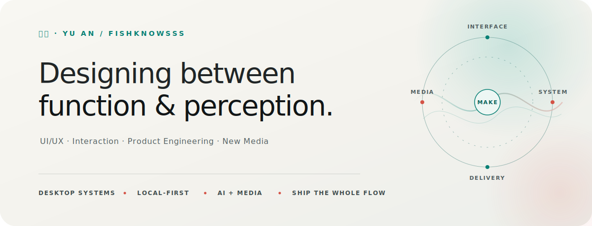

<picture>
  <source media="(max-width: 640px) and (prefers-color-scheme: dark)" srcset="./assets/hero-mobile-dark.svg">
  <source media="(max-width: 640px) and (prefers-color-scheme: light)" srcset="./assets/hero-mobile-light.svg">
  <source media="(prefers-color-scheme: dark)" srcset="./assets/hero-dark.svg">
  <source media="(prefers-color-scheme: light)" srcset="./assets/hero-light.svg">
  
</picture>

  <picture>
    <source media="(max-width: 640px) and (prefers-color-scheme: dark)" srcset="https://readme-typing-svg.demolab.com/?font=Manrope&amp;weight=500&amp;size=27&amp;height=56&amp;pause=2200&amp;color=8DE8DE&amp;center=true&amp;vCenter=true&amp;width=560&amp;lines=Building+local-first+desktop+tools;Exploring+audiovisual+interaction;Preparing+for+graduate+study+in+Japan">
    <source media="(max-width: 640px) and (prefers-color-scheme: light)" srcset="https://readme-typing-svg.demolab.com/?font=Manrope&amp;weight=500&amp;size=27&amp;height=56&amp;pause=2200&amp;color=0F766E&amp;center=true&amp;vCenter=true&amp;width=560&amp;lines=Building+local-first+desktop+tools;Exploring+audiovisual+interaction;Preparing+for+graduate+study+in+Japan">
    <source media="(prefers-color-scheme: dark)" srcset="https://readme-typing-svg.demolab.com/?font=Manrope&amp;weight=500&amp;size=22&amp;height=48&amp;pause=2200&amp;color=8DE8DE&amp;center=true&amp;vCenter=true&amp;width=980&amp;lines=Building+local-first+desktop+tools+and+studio+systems;Exploring+audiovisual+interaction+and+new+media+practice;Preparing+for+graduate+study+in+Japan">
    <source media="(prefers-color-scheme: light)" srcset="https://readme-typing-svg.demolab.com/?font=Manrope&amp;weight=500&amp;size=22&amp;height=48&amp;pause=2200&amp;color=0F766E&amp;center=true&amp;vCenter=true&amp;width=980&amp;lines=Building+local-first+desktop+tools+and+studio+systems;Exploring+audiovisual+interaction+and+new+media+practice;Preparing+for+graduate+study+in+Japan">
    
  </picture>

  
  
  
   
  
  
  

---

## About

I'm a Digital Media student working across **UI/UX**, **interaction research**, **visual prototyping**, **product engineering**, and **new media practice**.

My recent work spans **local-first desktop software**, **AI video workflows**, **studio operations**, and **media utilities**. I keep interface structure, system behavior, data ownership, failure states, and real delivery in the same design loop.

| Interface | Experience | Media | Context |
|---|---|---|---|
| UI/UX Design | Interaction Design | Digital Audiovisual Interaction | Cross-cultural Design |
| Information Architecture | Experience Design | New Media Art | Philosophy & Literature |
| Human-Computer Interaction | Visual Prototyping | Creative Coding | Art & Cultural Thinking |
| Product Interface | Local-first Experience | AI Video Workflow | Studio Systems |

<strong>Research-oriented design · Product systems · Local-first software · New media · Japan</strong>

---

## Selected Projects

<table>
  <tbody>
    <tr>
      <td colspan="2">
        <strong>🌊 YouYu</strong> — Windows Mihomo Desktop Client  
        
        
          
        <code>Electron</code> <code>React</code> <code>TypeScript</code> <code>Mihomo</code> <code>Cloudflare Worker</code> <code>NSIS</code>  
        A Windows x64 Mihomo client with beginner and advanced modes. It combines proxy and node control, health checks, TUN, system-network repair, traffic analytics, 16 connectivity tests, three independent update channels, and a 24-state desktop pet.  
        The release flow includes separate installers and update metadata, integrity checks, differential downloads, and full-package fallback.  
        <a href="https://fishknowsss.github.io/YouYu/">Project Site →</a> · <a href="https://github.com/fishknowsss/YouYu">Repository</a> · <a href="https://github.com/fishknowsss/YouYu/releases/latest">Latest Release</a> · <a href="https://github.com/fishknowsss/YouYu/blob/main/CHANGELOG.md">Changelog</a>
      </td>
    </tr>
    <tr>
      <td width="50%">
        <strong>🎛️ 118 Studio Manager</strong>  
        
          
        <code>React</code> <code>TypeScript</code> <code>IndexedDB</code> <code>PDF.js</code> <code>Vitest</code>  
        A local-first workspace for projects, tasks, people, schedules, shared accounts, short-drama production, and relationship graphs. IndexedDB remains the default data layer, with optional Worker / KV backup.  
        <a href="https://github.com/fishknowsss/118-Studio-Manager">Repository →</a>
      </td>
      <td width="50%">
        <strong>🎬 YQhub</strong>  
        
          
        <code>Electron</code> <code>TypeScript</code> <code>Seedance 2.0</code> <code>safeStorage</code>  
        A local workstation for generating videos through the Xiaoyunque Skill API, with material upload, prompt annotation, task queues, history, export naming, and automatic downloads. API keys stay encrypted on the device.  
        <a href="https://github.com/fishknowsss/YQhub">Repository →</a>
      </td>
    </tr>
    <tr>
      <td width="50%">
        <strong>🎞️ BatchWM</strong>  
        
          
        <code>Electron</code> <code>React</code> <code>ffmpeg</code> <code>macOS arm64</code>  
        A local batch video-watermark tool with text and image layers, nine-position placement, blend modes, landscape and portrait previews, progress, and shared sizing rules between preview and final output.  
        <a href="https://github.com/fishknowsss/BatchWM">Repository →</a> · <a href="https://github.com/fishknowsss/BatchWM/releases/latest">Download</a>
      </td>
      <td width="50%">
        <strong>🧩 ReSeq</strong>  
        
          
        <code>WPF</code> <code>C#</code> <code>.NET 8</code> <code>PowerShell</code>  
        A native Windows tool for managing short-drama files by shot and version number. Its thumbnail matrix supports drag insertion, full rename previews, conflict detection, two-stage temporary renaming, and best-effort rollback.  
        <a href="https://github.com/fishknowsss/ReSeq">Repository →</a>
      </td>
    </tr>
    <tr>
      <td width="50%">
        <strong>🗂️ AccMGMT</strong>  
        
          
        <code>React</code> <code>TypeScript</code> <code>Pages Functions</code> <code>D1</code>  
        A studio resource board for account availability, active use, future reservations, renewal reminders, projects, members, and group concurrency limits. Reservation overlap is handled as an explicit domain rule.  
        <a href="https://github.com/fishknowsss/AccMGMT">Repository →</a>
      </td>
      <td width="50%">
        <strong>🫧 Flowish</strong>  
        
          
        <code>React</code> <code>TypeScript</code> <code>Vite</code> <code>GitHub Pages</code>  
        A lightweight planning space for daily focus, backlog management, recurring rituals, calendar signals, and countdown events, with one-click local launchers and a simple static delivery path.  
        <a href="https://fishknowsss.github.io/Flowish/">Open Flowish →</a> · <a href="https://github.com/fishknowsss/Flowish">Repository</a>
      </td>
    </tr>
  </tbody>
</table>

---

## Methods & Tools

**Design / Prototype**

**Visual / Media**

**Creative Technology**

**Code / Frontend**

**Data / Cloud / Delivery**

**3D / Spatial**

**AIGC / Workflow**

---

## Current Focus

<table>
  <tbody>
    <tr>
      <td width="50%">
        <strong>Building</strong>
        <ul>
          <li>YouYu desktop experience, diagnostics, network safety, and release flow</li>
          <li>YQhub's local material-to-video workflow</li>
          <li>118 Studio Manager's local-first operations model</li>
          <li>Practical media tools for repeatable production delivery</li>
        </ul>
      </td>
      <td width="50%">
        <strong>Preparing</strong>
        <ul>
          <li>Graduate study in Japan, focused on UI/UX and interaction</li>
          <li>Cross-cultural art and design research</li>
          <li>A research portfolio connecting systems and new media practice</li>
        </ul>
      </td>
    </tr>
  </tbody>
</table>

---

## FISHKNOWSSS

> A name is a philosophy.

| Letter | Word | Meaning |
|:---:|---|---|
| **F** | Focus | Direct attention with intention, not distraction |
| **I** | Identity | Know who you are before you design for others |
| **S** | Syntonize | Tune in — to context, to users, to the unsaid |
| **H** | Heart | Let feeling inform thinking, not replace it |
| **K** | Kindle | Ignite curiosity, creativity, and care |
| **N** | Nirvana | Seek clarity beyond noise — design toward stillness |
| **O** | Observe | See before you speak. Watch before you make |
| **W** | Wish | Hold a vision of what could be |
| **S** | Simultaneously | Hold contradictions. Live in-between |
| **S** | Sacredly | Treat experience — of others and your own — as worth protecting |
| **S** | Stoically | Persist. Create without attachment to outcome |

***F**ocus **I**dentity. **S**yntonize **H**eart. **K**indle **N**irvana. **O**bserve **W**ish.* 
*——— **S**imultaneously, **S**acredly, **S**toically.*

---

## Writing & Practice

<table>
  <tbody>
    <tr>
      <td width="50%">
        <strong>Writing</strong>  
        Philosophy, literature, media, contemporary life, and social structure — with recurring notes on interface trust, creative-tool friction, attention, and collaboration.  
        <strong>Independent long-form project:</strong> <em>《满盈》</em>
      </td>
      <td width="50%">
        <strong>Media Practice</strong>  
        Interface concepts, interaction prototypes, creative coding, audiovisual works, and AIGC-assisted media — different ways of studying how experience is structured, perceived, and communicated.
      </td>
    </tr>
  </tbody>
</table>

---

  
  

<code>Designing between function, perception, media, and expression.</code>

